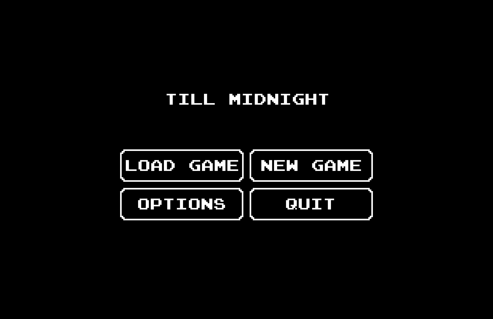
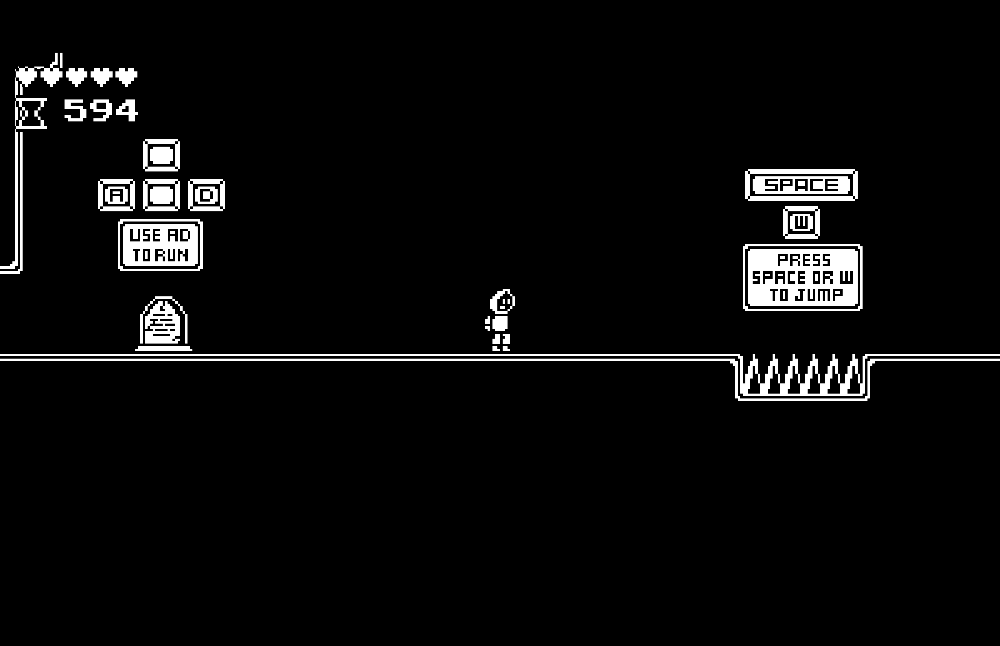
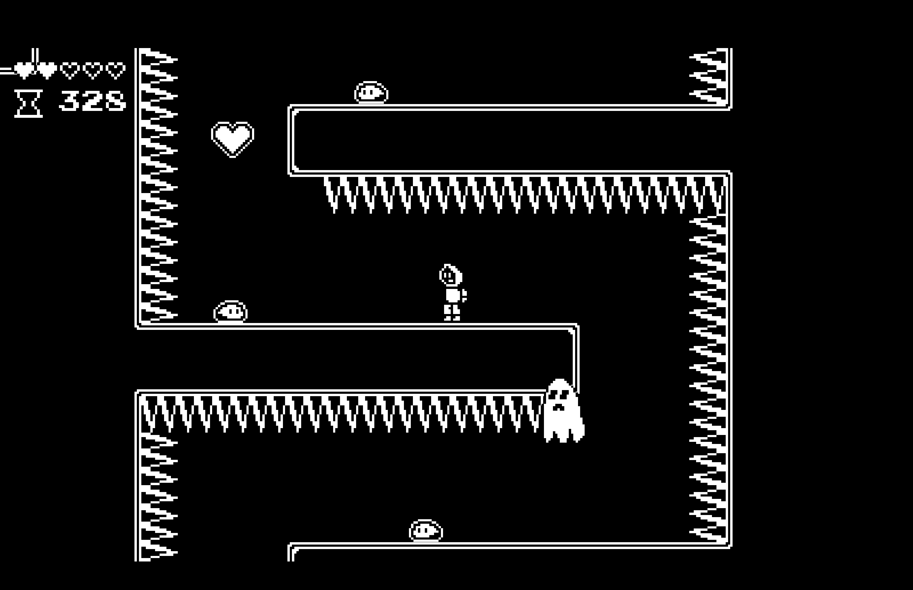
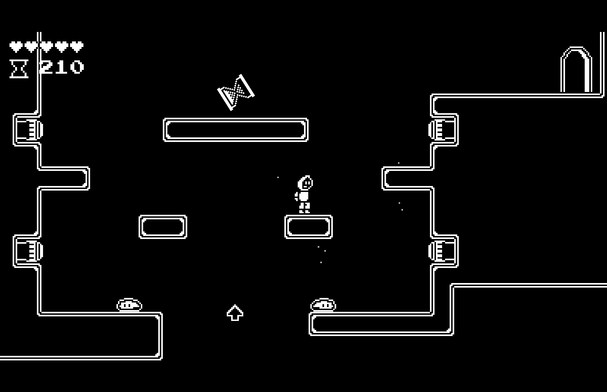
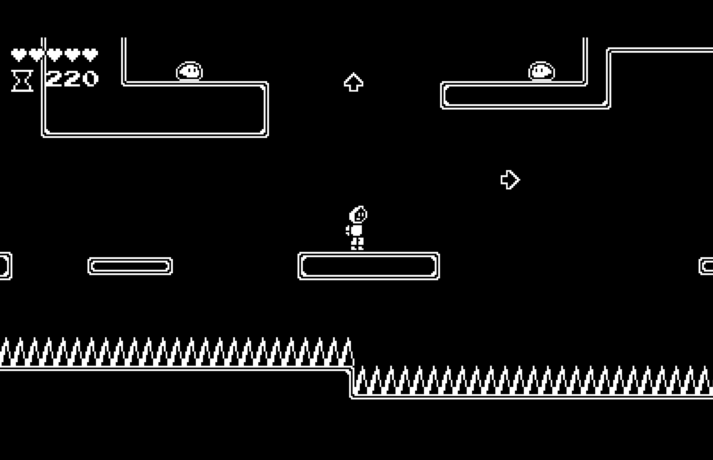
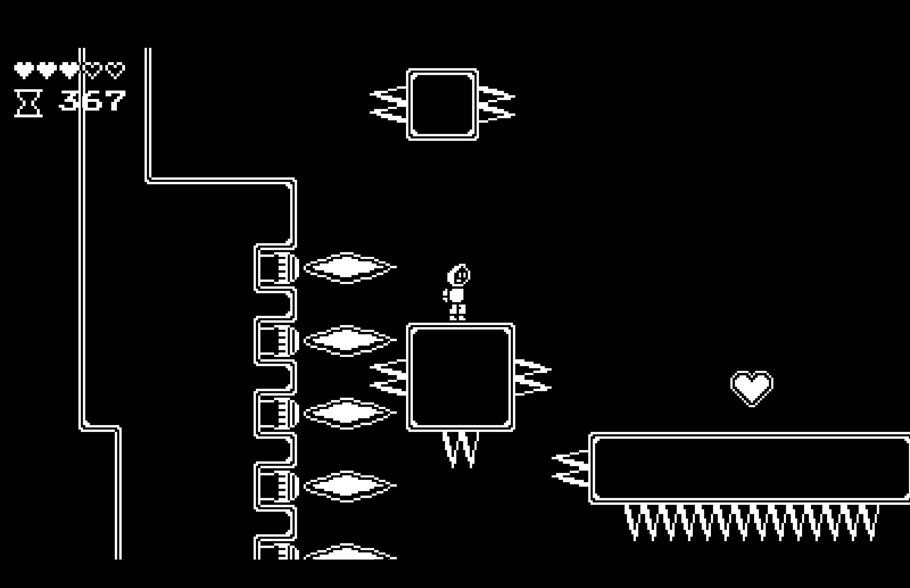
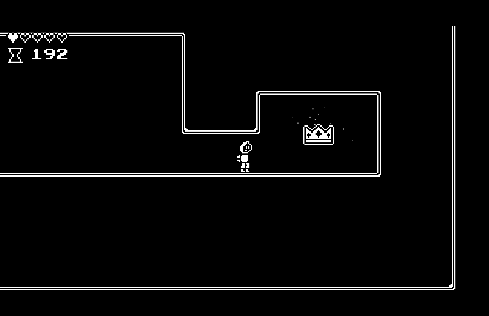

# Till Midnight

Till Midnight is a short 1-bit platformer built with the [Godot](https://godotengine.org) game engine.

[Overview Video](https://www.youtube.com/watch?v=u1Ohj9SxH1I)

## Controls

```text
W, Space, UP_ARROW -> Jump
A, D, LEFT_ARROW, RIGHT_ARROW -> Horizontal Movement
S, DOWN_ARROW -> May be used to slide down walls at quicker speeds
F -> Attack
Shift -> Quick reload of previous save
```

## Screenshots









## Credits

### Art and Visuals

All art and visuals (excluding font) done by Jesal Patel and Billie Pirtle

### Music and Sound

[VGM Pack by Soon to be Dead](https://soon-to-be-dead.itch.io/free-8bit) - This pack contains all the music used for Till Midnight

[Sounds Effects Pack 2 by Swiss Arcade Game Entertainment](https://phoenix1291.itch.io/sound-effects-pack-2) - This sound pack contains the sounds used for Till Midnight's PlayerDamage, EnemyDeath, and Teleport sounds

[Melee Sounds by Iwan Gabovitch and Edited by Remaxin](https://opengameart.org/content/3-melee-sounds) - This sound pack contains the sound used for Till Midnight's SwordSlash

[1000+ Cool Nintendo SFX by GameSupplyGuy](https://gamesupply.itch.io/1000-nintendo-sound-effects) - This sound pack contains the sounds used for EnemyDamage and MenuButtonClick

[Dark Ambiences by Ogrebane](https://opengameart.org/content/dark-ambiences) - This sound pack contains the sound used for the SaveGrave sound effect

[200 Free SFX by Kronbits](https://kronbits.itch.io/freesfx) - This sound pack contains the sound effects used for Powerup, NextLevel, and SlimeProjectile sounds

[Jump_C_01 by cabled_mess](https://freesound.org/people/cabled_mess/sounds/350902/) - This sound effect is used for the Jump sound

[Steps by dklon](https://opengameart.org/content/stepping-sounds) - This sound effect is used for the steps sound

[The Essential Retro Video Game Sounds Effects Collection [512 Sounds] by Juhani Junkala](https://opengameart.org/content/512-sound-effects-8-bit-style) - This sound pack contains the sounds used for Pause and MenuButtonHover sound effects

[Shapeforms Audio Free Sound Effects by Shapeforms](https://shapeforms.itch.io/shapeforms-audio-free-sfx) - This sound pack contains the audio used for SkeletonPunch

### Font
[Joystix Font by Raymond Larabie](https://www.1001fonts.com/joystix-font.html)
